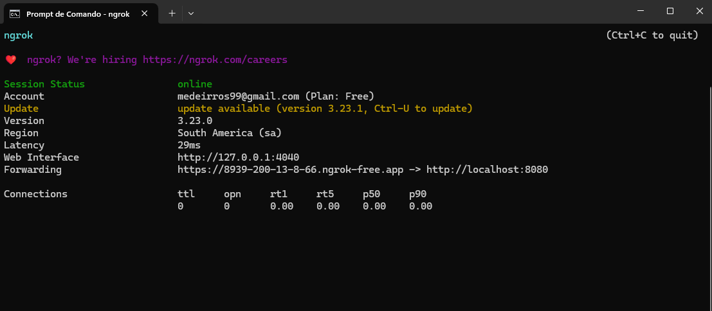

# 🚀 Sistema NESBUS – Integração Front (Bubble) + Back (Spring Boot) + Ngrok

O NESBUS é um sistema para gerenciamento de viagens de pacientes, composto por:

- **Front-end:** criado no **Bubble**, onde os usuários interagem, fazem solicitações e administradores aprovam.
- **Back-end:** desenvolvido em **Java com Spring Boot**, responsável por persistir e tratar os dados.
- **Ngrok:** usado durante o desenvolvimento para permitir que o Bubble envie e receba dados da API mesmo localmente.

---

## 📌 Como Funciona

```
[ Usuário ]
   |
   v
[ Bubble (Interface) ]
   |
   | ➜ Solicita viagens, aprovações, logins
   v
[ Ngrok (exposição segura) ]
   |
   v
[ Spring Boot (API REST local) ]
   |
   v
[ Banco de Dados ]
```

---

## 🎨 Front-end com Bubble

No Bubble ocorre:

- Cadastro e login de usuários
- Solicitações de viagens (com ou sem acompanhante)
- Criação de novas viagens por administradores
- Aprovação ou rejeição de solicitações
- Visualização de passageiros por viagem
- Controle de vagas disponíveis
- Marcar viagens como realizadas


Bubble se comunica diretamente com a API do Spring usando chamadas HTTP (GET, POST, PATCH...), usando o link do **Ngrok** para acessar o back-end.

---

## 🧠 Back-end com Spring Boot

A API desenvolvida em Java com Spring Boot é responsável por:

- Receber solicitações de viagens
- Salvar e listar usuários
- Cadastrar novas viagens
- Controlar vagas disponíveis
- Expor os dados para o Bubble via JSON

### Exemplo de Endpoints:

| Ação                          | Método | URL                                      |
|------------------------------|--------|------------------------------------------|
| Criar viagem                 | POST   | `/viagem`                                |
| Listar viagens               | GET    | `/viagem/listar`                         |
| Buscar usuários da viagem    | GET    | `/viagem/uuid/{uuid}`                    |

---

## 🌐 Conexão via Ngrok

Ngrok é usado para gerar um **link público** que aponta para o seu back-end local (`localhost:8080`). Isso permite que o Bubble consiga fazer requisições mesmo que o servidor esteja rodando apenas no seu computador.
